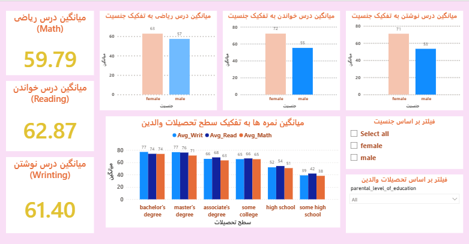

📊 پروژه Power BI – داشبورد عملکرد تحصیلی دانش‌آموزان
📌 توضیحات پروژه
در این پروژه با استفاده از SQL، Power BI و زبان DAX عملکرد تحصیلی دانش‌آموزان تحلیل شده.
هدف این بوده که ببینیم جنسیت، آمادگی قبل از آزمون، گروه مطالعه و سطح تحصیلات والدین چه تأثیری روی نمرات دانش‌آموزان در دروس ریاضی، مطالعه (Reading) و نوشتن (Writing) دارند.

🧰 ابزارها و تکنولوژی‌ها

🗄️ SQL – برای پاک‌سازی و آماده‌سازی اولیه داده‌ها

📊 Power BI – برای طراحی داشبورد و ساخت نمودارها

📈 DAX – برای محاسبه میانگین نمرات و شاخص‌های کلیدی

🖥️ صفحه اول: نمای کلی
✅ کارت‌ها:

تعداد کل دانش‌آموزان

تعداد دخترها

تعداد پسرها

📊 نمودارها:

میانگین نمرات بر اساس وضعیت دوره آمادگی پیش از آزمون

تعداد دانش‌آموزان بر اساس گروه تحصیلی

🎛️ فیلتر (اسلایسر):

فیلتر بر اساس جنسیت
### 📄 Dashboard – Page 1

📑 صفحه دوم: تحلیل دروس
📈 شاخص‌های کلیدی با DAX:

میانگین نمره درس ریاضی

میانگین نمره مطالعه

میانگین نمره نوشتن

📊 نمودارها:

نمودار میانگین نمره ریاضی بر اساس جنسیت

نمودار میانگین نمره مطالعه بر اساس جنسیت

نمودار میانگین نمره نوشتن بر اساس جنسیت

نمودار میانگین نمرات بر اساس سطح تحصیلات والدین

🎛️ فیلترها (اسلایسر):

فیلتر بر اساس جنسیت

فیلتر بر اساس تحصیلات والدین
### 📄 Dashboard – Page 2

📂 فایل‌های موجود در پروژه
student_performance1.pbix	فایل اصلی پروژه Power BI
student_performance_analysis.sql	فایل SQL برای پاک‌سازی اولیه داده‌ها
/Stu1 , Stu2/	 تصاویر داشبورد
README.md	همین فایل توضیحات پروژه 😄

🌟 امکانات استفاده‌شده
✅ اسلایسر (Slicer)

✅ کارت‌های آماری (KPI Cards)

✅ نمودار ستونی و میله‌ای

✅ توابع DAX برای محاسبه میانگین

✅ پاک‌سازی اولیه با SQL

